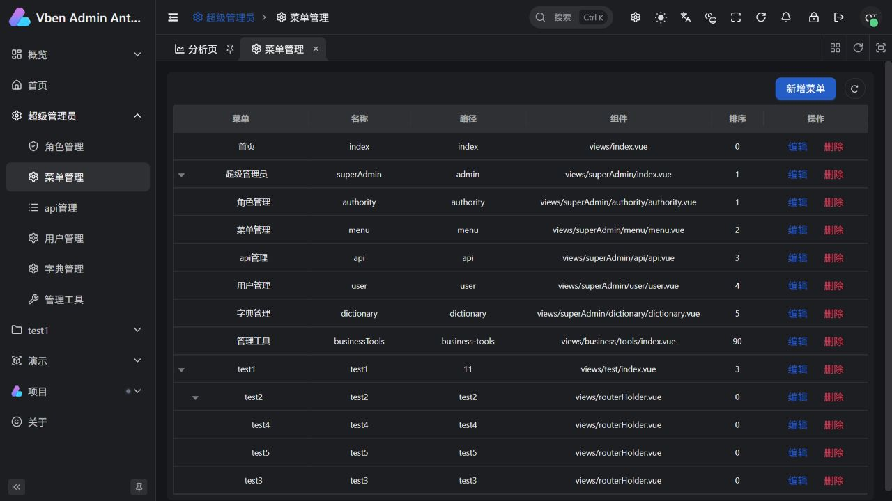
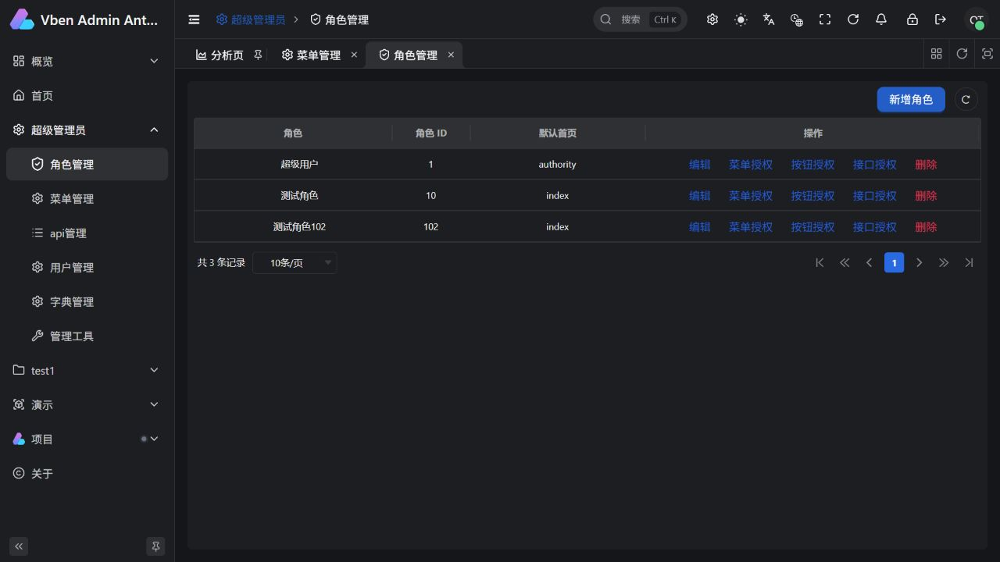
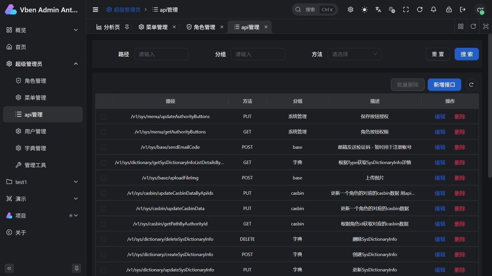
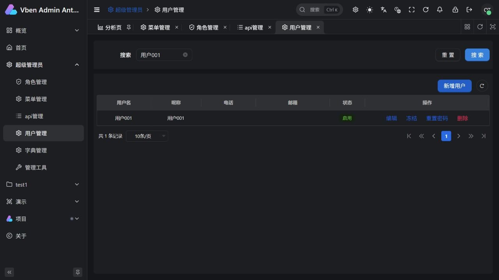
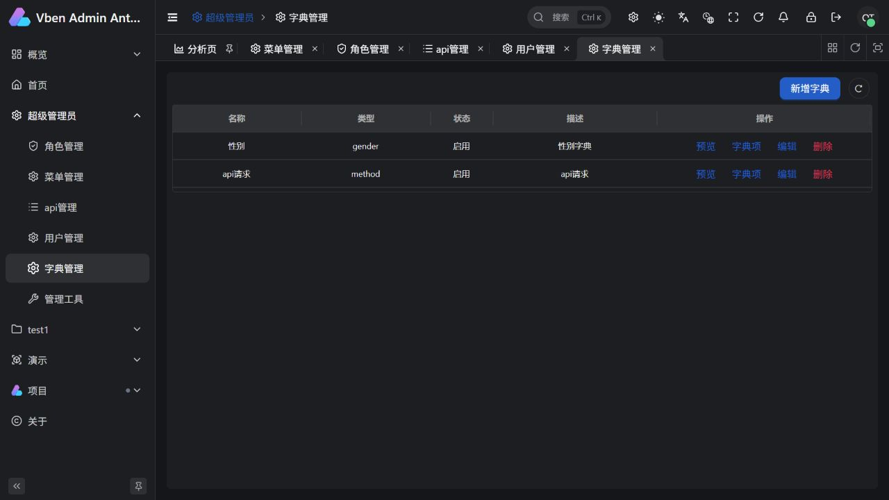
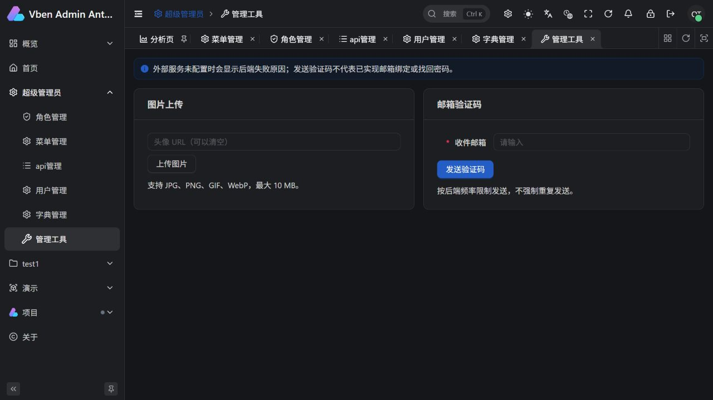
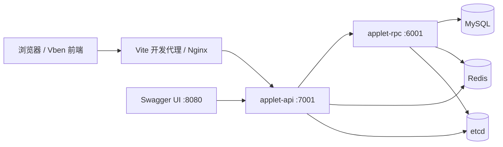

# go-zero-admin

基于 **go-zero + GORM + Casbin** 的管理后台，前端使用 **Vue Vben Admin / web-antdv-next**。提供用户、角色、菜单、接口权限、字典和基础工具，适合作为业务管理系统的开发起点。

- 后端仓库：[yh-zero/go-zero-admin](https://github.com/yh-zero/go-zero-admin)
- 配套前端：[yh-zero/go-zero-admin-vben](https://github.com/yh-zero/go-zero-admin-vben)
- 本地接口文档：[Swagger UI](http://localhost:8080) · [Swagger JSON](data/api/generated/go-zero-admin.swagger.json)

**开发方式：Docker 启动依赖，API / RPC 在本机运行，前端单独启动。服务器部署使用另一份 Compose 配置。**

## 目录

- [功能与页面](#功能与页面)
- [架构与代码目录](#架构与代码目录)
- [环境要求](#环境要求)
- [本地开发启动](#本地开发启动)
- [接口文档与调试](#接口文档与调试)
- [开发流程与代码生成](#开发流程与代码生成)
- [可选服务配置](#可选服务配置)
- [服务器部署](#服务器部署)
- [检查与测试](#检查与测试)
- [常见问题](#常见问题)
- [相关文档与许可证](#相关文档与许可证)

## 功能与页面

| 模块 | 当前功能 |
| --- | --- |
| 登录与权限 | 图片验证码、JWT 登录、当前用户查询、自助改密、服务端退出与会话撤销 |
| 用户管理 | 搜索与分页、新增与编辑、角色分配、启用 / 冻结、重置密码、删除 |
| 角色管理 | 角色树、默认首页、菜单 / 按钮 / API 独立授权，分组搜索、选择统计与变更预览 |
| 菜单管理 | 菜单树、页面组件与图标选择、按钮定义维护、排序、隐藏与缓存 |
| API 管理 | 路径 / 分组 / 方法筛选、资源维护、批量删除、Swagger 差异预览与选择同步 |
| 字典管理 | 字典与字典项维护、状态、排序、预览 |
| 管理工具 | 阿里云 OSS 图片上传、SMTP 邮箱验证码发送 |
| Vben 原有页面 | 保留工作台、分析页、组件演示，与后端业务菜单合并显示 |

下面是当前前端连接本地后端的实际截图（2026-09-25）。页面数据为开发示例；截图随代码保存在本仓库，GitHub 可直接展示。

### 菜单管理



<details>
<summary>查看其他模块截图：角色、API、用户、字典、管理工具</summary>

### 角色管理



### API 管理



### 用户管理



### 字典管理



### 管理工具



</details>

当前代码注册 **48 个 HTTP 接口**，统一使用 `/v1/sys` 前缀。业务页面已接入；尚未实现的旧菜单组件显示“尚未接入”。OSS 上传和 SMTP 发送需要配置真实外部服务后验收；操作日志尚未实现。

## 架构与代码目录



API 层处理 HTTP 参数、JWT、当前会话校验和响应封装；RPC 层实现业务、数据库操作及 Casbin 权限校验。Redis 用于验证码和权限策略同步，etcd 用于 RPC 注册与发现。前端只访问 HTTP API。

建议将两个仓库放在同一级目录：

```text
go-zero-github/
├── go-zero-admin/                  # 后端仓库
│   ├── application/applet/
│   │   ├── api/
│   │   │   ├── desc/               # .api 接口定义
│   │   │   ├── etc/                # 本机 API 配置
│   │   │   └── internal/           # handler、logic、types、middleware
│   │   └── rpc/
│   │       ├── desc/               # .proto 协议
│   │       ├── etc/                # 本机 RPC 配置
│   │       ├── internal/           # 业务 logic、model、服务上下文
│   │       ├── client/             # 生成的 RPC 客户端
│   │       └── pb/                 # 生成的 protobuf 代码
│   ├── pkg/                        # 响应、错误码、ORM、权限等公共实现
│   ├── data/
│   │   ├── api/generated/          # 当前 Swagger JSON
│   │   ├── db/migrations/          # 增量 SQL
│   │   └── doc/screenshots/        # README 页面截图
│   ├── docker/                     # 服务器部署与 Swagger 配置
│   ├── test/goctl/                 # 自定义 goctl 模板
│   ├── test/sh/                    # 生成与联调脚本
│   └── docker-compose.yml         # 仅本地开发依赖
└── go-zero-admin-vben/             # 前端仓库
    └── apps/web-antdv-next/        # 业务前端应用
```

## 环境要求

| 工具 | 要求 / 当前项目配置 |
| --- | --- |
| Go | 推荐 1.26.x，与 Docker 构建版本一致；`go.mod` 声明 1.24.0 |
| Docker | Docker Engine / Docker Desktop，启用 Compose v2（`docker compose`） |
| Node.js | `^22.18.0` 或 `^24.12.0`，以配套前端 `package.json` 为准 |
| pnpm | `11.16.0`，与前端 `packageManager` 保持一致 |
| PowerShell | Windows PowerShell 5.1 即可运行 Swagger 和数据库管理脚本，无需安装 `pwsh` |
| goctl | 修改接口或生成文档时需要；当前脚本使用已验证的 `v1.10.2` |
| protobuf 工具 | 仅重新生成 RPC 时需要 `protoc`、`protoc-gen-go`、`protoc-gen-go-grpc` |

后端框架当前为 go-zero `v1.10.3`，使用 MySQL 8、Redis 7、etcd 3.5。直接启动已生成的代码不需要安装 goctl 或 protobuf 工具。

## 本地开发启动

以下示例以 Windows PowerShell 为主。除特别说明外，命令都在 **`go-zero-admin` 根目录**执行；已经拉取的项目可跳过克隆。

### 1. 获取前后端代码

在准备存放项目的父目录执行：

```powershell
git clone https://github.com/yh-zero/go-zero-admin.git
git clone https://github.com/yh-zero/go-zero-admin-vben.git
cd go-zero-admin
```

### 2. 启动开发依赖

```powershell
docker compose up -d
docker compose ps
```

等待 `docker compose ps` 中 MySQL、Redis、etcd 显示 `healthy` 后，再执行下面的数据库步骤。首次初始化空数据卷可能需要更长时间。

根目录配置不需要 `.env` / `.env.example`，也不会启动 API、RPC 或前端。Docker Desktop 中统一归入 `go-zero-admin` 项目。

| 服务 | 容器名称 | 本机地址 | 本地配置 |
| --- | --- | --- | --- |
| MySQL | `gozero-mysql` | `127.0.0.1:3306` | 用户 `root`，密码 `123456`，数据库 **`goZero-admin`** |
| Redis | `gozero-redis` | `127.0.0.1:6379` | 无密码 |
| etcd | `gozero-etcd` | `127.0.0.1:2379` | 本地 RPC 服务发现 |
| Swagger UI | `gozero-swagger` | [localhost:8080](http://localhost:8080) | 查看与调试接口 |

这些容器端口只绑定本机。MySQL 使用命名卷 `go-zero-admin_mysql_data`；Redis、etcd 未配置持久化卷。首次使用空 MySQL 卷时自动导入 [基线 SQL](data/db/gozero-admin-20240129.sql)，已有数据卷不会重复导入，也不会因修改 Compose 而自动修改数据库密码。

### 3. 初始化或升级数据库

**新库和已有库都需要应用增量迁移。** 使用统一脚本按文件名顺序执行，不再手工逐个 `SOURCE`。基线 SQL 只用于空数据卷的首次初始化，不能重新导入已有业务库；`Init` 也不会清空已有数据库。

Windows PowerShell 5.1，在后端根目录执行：

```powershell
# 首次准备：启动并等待开发依赖，然后备份并执行未应用的迁移
powershell.exe -NoProfile -ExecutionPolicy Bypass -File .\test\sh\db.ps1 -Action Init

# 日常升级：MySQL 已运行时检查、备份或应用新增迁移
powershell.exe -NoProfile -ExecutionPolicy Bypass -File .\test\sh\db.ps1 -Action Status
powershell.exe -NoProfile -ExecutionPolicy Bypass -File .\test\sh\db.ps1 -Action Backup
powershell.exe -NoProfile -ExecutionPolicy Bypass -File .\test\sh\db.ps1 -Action Migrate
```

Linux Shell 的对应命令（需 `sha256sum`）：

```sh
sh test/sh/db.sh init
sh test/sh/db.sh status
sh test/sh/db.sh backup
sh test/sh/db.sh migrate
```

`Init` 可代替第 2 步的启动命令；开发模式只启动 MySQL、Redis、etcd、Swagger，不启动 API/RPC。`Status` 不写迁移数据；`Backup` 单独导出当前数据库；`Migrate` 只应用未登记的脚本。脚本使用所选 Compose 中 MySQL 的数据库名及凭据，不需要宿主机安装 MySQL 客户端。

当前包含 6 份迁移：

| 脚本 | 用途 |
| --- | --- |
| [20260925_business_access.sql](data/db/migrations/20260925_business_access.sql) | 补齐管理菜单、按钮、API 及管理员权限，修正历史菜单方法配置 |
| [20260925_user_active_username.sql](data/db/migrations/20260925_user_active_username.sql) | 活跃用户名唯一，允许复用已软删除用户名 |
| [20260926_00_method_dictionary.sql](data/db/migrations/20260926_00_method_dictionary.sql) | 仅修正完全匹配旧初始化数据的 HTTP 方法字典 POST 值；用户修改过的数据不自动改动 |
| [20260926_api_sync_access.sql](data/db/migrations/20260926_api_sync_access.sql) | 登记 API 同步接口及按钮，并补内置管理员的对应授权 |
| [20260926_business_unique.sql](data/db/migrations/20260926_business_unique.sql) | 为菜单、API、字典及字典项增加兼容软删除的唯一约束，发现冲突先停止 |
| [20260926_session_version.sql](data/db/migrations/20260926_session_version.sql) | 为用户增加会话版本；升级前签发的旧 JWT 需要重新登录 |

迁移器在 `schema_migrations` 保存文件名、SHA-256 校验值和执行时间。已应用且校验一致的文件会跳过；修改已应用文件会报错，应新增迁移文件。执行待应用迁移前自动备份至 **`bin/db-backups/`**，同时生成 `.sha256` 文件；备份失败则不继续。备份包含选中数据库的结构和数据，不含 Redis、OSS 或源码。

迁移遇错立即停止，不把失败文件登记为已应用。MySQL DDL 会隐式提交，不能假设全部步骤自动回滚；确认错误及实际结构后处理冲突，再重跑。为避免并发升级，脚本使用 MySQL 容器内 `/tmp/gozero-db-migrate.lock`；若进程异常终止留下锁，先确认没有其他迁移仍在执行，再清理该空锁目录并重试。不要在迁移运行中删锁。

迁移完成后重启 RPC/API，重新登录或刷新前端权限。正常通过管理接口保存权限会自动同步，不需要重启服务。

### 4. 分别启动 RPC 和 API

先下载 Go 依赖：

```powershell
go mod download
```

**终端一：RPC**（在后端根目录执行）：

```powershell
go run ./application/applet/rpc -f ./application/applet/rpc/etc/applet.yaml
```

**终端二：API**（另开终端，在后端根目录执行）：

```powershell
go run ./application/applet/api -f ./application/applet/api/etc/applet-api.yaml
```

也可在 VS Code 调试这两个入口，使用相同的 `-f` 配置路径。先确认 RPC 正常，再启动 API。配置地址变动时同步核对：

- [API 配置](application/applet/api/etc/applet-api.yaml)：端口、Redis、etcd、JWT、OSS。
- [RPC 配置](application/applet/rpc/etc/applet.yaml)：MySQL、Redis、etcd、JWT、默认重置密码。
- API 与 RPC 的 `JwtAuth.AccessSecret` 必须一致，etcd 的服务键均为 `applet.rpc`。

检查 API 能否返回验证码数据：

```powershell
Invoke-RestMethod http://127.0.0.1:7001/v1/sys/randomImage
```

### 5. 启动前端并登录

另开终端，进入同级前端仓库根目录：

```powershell
cd ..\go-zero-admin-vben
pnpm install --frozen-lockfile
pnpm dev
```

如果从其他目录打开终端，请直接进入实际的 `go-zero-admin-vben` 路径。依赖在前端仓库根目录安装，不要只复制或单独安装 `apps/web-antdv-next`。

| 项目 | 地址 / 值 |
| --- | --- |
| 前端 | [http://127.0.0.1:5999](http://127.0.0.1:5999) |
| 本地开发账号 | `admin` |
| 本地开发密码 | `123456` |
| API | `http://127.0.0.1:7001` |
| RPC | `127.0.0.1:6001`，供后端内部调用 |

登录时填写当前图片验证码。验证码不是固定值；当前实现始终校验验证码，配置中的旧 `Isdev` 注释不能作为绕过依据。已有数据库若修改过账号密码，以实际数据为准。

前端开发配置位于 `apps/web-antdv-next/.env.development`，已关闭 Mock。`vite.config.ts` 将 `/api` 转发到 `http://127.0.0.1:7001`，并去掉 `/api` 前缀：

```text
浏览器：http://127.0.0.1:5999/api/v1/sys/menu/getMenu
后端：  http://127.0.0.1:7001/v1/sys/menu/getMenu
```

端口被占用时，以前端启动终端输出的地址为准。

### 6. 日常停止与重启

```powershell
# 在后端根目录查看开发依赖日志
docker compose logs --tail=100

# 停止依赖，保留容器和数据
docker compose stop

# 再次启动依赖
docker compose up -d
```

API、RPC 和前端在各自终端按 `Ctrl+C` 停止，按前述命令重新启动。`docker compose down -v` 会删除数据库卷，不能当作日常停止命令。

## 接口文档与调试

### 访问 Swagger

开发依赖启动后访问 [Swagger UI](http://localhost:8080)，JSON 地址为 [swagger.json](http://localhost:8080/swagger.json)。当前文件是 [data/api/generated/go-zero-admin.swagger.json](data/api/generated/go-zero-admin.swagger.json)，格式为 Swagger 2.0，可导入 Apifox 等工具。

查看文档不要求 API / RPC 已运行；**执行接口需要完整后端和依赖**。Swagger 容器把 `/v1/sys` 请求转发到宿主机 `7001`，避免浏览器跨域。历史文件 `data/api/go-zero-admin.openapi.json` 仅供参考，不作为最新接口依据。

### 登录与鉴权步骤

1. 调用 `GET /v1/sys/randomImage`，读取 `result.captchaId` 与 `result.captchaImg`。图片字段是 Data URL，可在浏览器查看；Swagger 通常显示字符串。
2. 调用 `POST /v1/sys/login`，提交用户名、密码、验证码 ID 和图片中的字符。
3. 从 `result.accessToken` 取得令牌，在 Swagger 的 **Authorize** 中填写完整的 `Bearer <accessToken>`。
4. 调用 `GET /v1/sys/menu/getMenu` 验证登录，再调试业务接口。GET 参数放在 query 中，不发送 GET body。

登录请求示例（验证码值需替换为当前实际值）：

```json
{
  "username": "admin",
  "password": "123456",
  "captchaId": "当前返回的 captchaId",
  "captcha": "当前图片中的字符"
}
```

图片验证码为六位字符，有效期为 120 秒，提交校验后会消费；登录失败应重新获取图片。菜单是否显示、按钮是否可见、API 是否允许调用是三类权限，需要分别配置。

### 当前用户、改密码与会话撤销

| 接口 | 用途 |
| --- | --- |
| `GET /v1/sys/me` | 按当前 JWT 查询本人最新资料，前端刷新时使用 |
| `PUT /v1/sys/changePassword` | 提交 `oldPassword`、`newPassword` 自助改密，成功后重新登录 |
| `POST /v1/sys/logout` | 撤销当前账号的所有已登录设备会话，再清理前端状态 |

这 3 个接口需要有效登录态，不需要单独分配 Casbin 业务权限。默认 JWT 有效期为 **2 小时**，API 每次验证用户状态、角色和数据库会话版本；改密、管理员重置密码、冻结、删除或角色变更后，旧会话不再有效。`logout` 是**账号所有设备退出**，不是只退出一个标签页。普通资料修改不等于改密或角色切换；目前仍无 refreshToken 和独立切换角色接口。

前端个人中心位于 `/account`，提供真实资料和自助改密。浏览器缓存仅用于会话恢复，不能替代 `/me` 与后端鉴权；旧请求晚到时不会覆盖新登录资料或清理新会话。

成功响应示例：

```json
{
  "code": 200,
  "message": "操作成功!",
  "result": {},
  "returnData": null,
  "success": true,
  "timestamp": 1780000000
}
```

`result` 随接口变化，可为对象或 `null`；错误响应通常只有 `code`、`message`。业务错误和 JWT 失效可能仍返回 HTTP 200，必须检查业务码；当前 JWT 失效码为 `100003`，权限拒绝也可能直接返回 HTTP 403。前端 `requestClient` 已处理统一响应，业务函数直接使用解包后的数据。

### 更新 Swagger

首次需要时安装生成工具：

```powershell
go install github.com/zeromicro/go-zero/tools/goctl@v1.10.2
```

在后端根目录执行：

```powershell
powershell.exe -NoProfile -ExecutionPolicy Bypass -File .\test\sh\swagger.ps1
```

脚本以 `.api` 为来源，调用 goctl 生成并补齐项目实际的响应包装、鉴权及上传约定，**只生成文档，不修改业务源码**。脚本支持自动查找 Go 的 bin 目录，也可通过 `-GoctlPath` 指定工具路径。

更新顺序：修改接口声明与实现 → 必要时重新生成 API / RPC → **生成 Swagger → 重新构建 RPC/API** → 刷新文档验证 → 一起提交源码与 JSON。不要手工修改生成的 JSON。Swagger UI 挂载文件，更新 JSON 后刷新即可；API 资源同步使用 RPC 编译时嵌入的 Swagger，必须先生成文档再构建、重启 RPC，否则同步预览仍是旧版本。

### 同步 API 资源

API 管理页的“同步后端接口”调用 `GET /v1/sys/api/previewSync`，分别展示新增、说明变更及不在当前授权清单中的资源。后一类可能是已移除路由，也可能是登录等仍存在但无需 Casbin 授权的路由，不能直接视为接口已删除。开发者勾选后调用 `POST /v1/sys/api/applySync`，提交预览 `version` 与所选 `keys`；版本过期需重新预览并选择。

同步只新增资源或更新分组和描述，保留原资源 ID 及已有角色策略；**不会自动授予新增 API 权限，也不会删除不在授权清单中的资源**。同步完成后到角色页单独授权；其他资源需核实用途后在 API 列表处理。菜单、按钮和接口权限仍分别保存，不能用接口同步替代角色授权。

调整文档端口或后端目标时，修改根 Compose 中 Swagger 的端口和 `SWAGGER_API_URL`，然后执行：

```powershell
docker compose up -d --no-deps --force-recreate swagger-ui
```

目标填写容器可达的协议、主机、端口，例如 `http://host.docker.internal:7001`，不加接口路径或末尾斜杠。Linux 下仅监听宿主机 `127.0.0.1` 的 API 无法通过 host-gateway 访问。

## 开发流程与代码生成

### 新增一个业务模块

1. **先定义接口。** 在 `application/applet/api/desc/` 明确方法、路径、参数、分页、返回值及错误；需要 RPC 时同步修改 `application/applet/rpc/desc/applet.proto`。
2. **生成骨架并实现逻辑。** API 层负责协议适配，RPC 层负责业务与数据；数据库变更放入 `data/db/migrations/`，避免覆盖现有库。
3. **新增前端文件。** 页面放 `src/views/business/<模块>/`，请求和类型放 `src/api/business/`；优先复用现有表格、表单和弹窗。
4. **建立菜单映射。** 在前端 `src/adapter/business/pages.ts` 单处登记组件，菜单下拉与动态路由共用。保留历史 `component` 值，通过映射接到新页面，减少数据库改动。`/account` 为真实个人中心保留路径。
5. **配置三类权限。** 菜单编辑器维护按钮名称和权限标识，保留未删除按钮 ID 与原菜单参数；删除按钮会清理关联授权，修改标识需同步页面使用的 `菜单name:按钮name`。角色页按菜单或 API 分组筛选、查看新增/撤销明细并分别保存；修改非当前角色仅局部更新，修改当前角色才刷新权限。API 策略使用 `/v1/sys/...` 与实际方法，不包含 `/api` 代理前缀。
6. **验证并更新文档。** 检查成功与失败、空数据、重复提交、零值 / 空值、普通角色无权限等流程，重新生成 Swagger。

前端业务代码尽量独立于 Vben 原有页面和共享包，通过配置、适配器、插槽扩展；确需改动框架文件时记录原因与回归项，便于以后升级。详细约定见配套前端的 [开发文档](https://github.com/yh-zero/go-zero-admin-vben/blob/HEAD/DEVELOPMENT.zh-CN.md) 和 [接口接入流程](https://github.com/yh-zero/go-zero-admin-vben/blob/HEAD/DEVELOPMENT-WORKFLOW.zh-CN.md)。本机同级前端仓库中也有这两个文件。

### 常用生成命令

下列命令在后端根目录执行。生成前保留当前改动，生成后检查差异，尤其是自定义 handler、鉴权、上传限制和已实现的业务逻辑。

```powershell
# 修改 .api 后生成 API 代码
.\test\sh\api.bat applet

# 修改 .proto 后生成 RPC 代码，需要 protobuf 工具在 PATH 中
.\test\sh\rpc.bat applet applet

# 格式化 API 定义
goctl api format --dir ./application/applet/api/desc

# 更新接口文档
powershell.exe -NoProfile -ExecutionPolicy Bypass -File .\test\sh\swagger.ps1
```

API 脚本使用 `test/goctl` 下的自定义模板：

| 模板 | 作用 |
| --- | --- |
| [handler.tpl](test/goctl/api/handler.tpl) | 使用 `result.HttpResult` 统一响应 |
| [main.tpl](test/goctl/api/main.tpl) | JWT 失效回调返回统一业务错误码 |

`test/goctl/1.10.3/api/` 保留版本快照，实际 API 脚本使用版本无关的模板覆盖。RPC 脚本保留 `--name-from-filename`，避免入口名称随 proto 包名变化。升级 Go、go-zero、goctl 或 Vben 时分开处理，先验证生成差异，再做功能回归。

模型位于 `application/applet/rpc/internal/model/`。使用 GORM 生成工具时先输出到临时目录，再合并需要的结构；不要直接覆盖项目已有模型。创建包含软删除字段的记录时，确保 `DeletedAt.Valid = false` 或省略 `deleted_at`，避免写入无效的零日期。

## 可选服务配置

### 图片上传

配置 API 的 `Oss.Endpoint`、`AccessKeyId`、`AccessKeySecret`、`BucketName`。本机也支持通过 `AliYunOss_go-zero-admin` 环境变量传入同名字段组成的 JSON；Docker 部署模板使用 `OSS_*` 环境变量。

接口为 `POST /v1/sys/base/uploadFileImg`，使用 `multipart/form-data`，文件字段名 **`file_img`**；支持 JPG、PNG、GIF、WebP，单文件最大 **10 MB**。未配置 OSS 时其他管理模块仍可运行，上传会返回配置或服务错误。

### 邮箱验证码

API 支持 `Mail` 配置，也支持以下环境变量：

| 环境变量 | 含义 |
| --- | --- |
| `SMTP_HOST` | SMTP 服务地址 |
| `SMTP_PORT` | 端口，默认 `465` |
| `SMTP_USER` | 登录账号 |
| `SMTP_PASSWORD` | SMTP 密码或服务商授权码 |
| `SMTP_FROM` | 发件邮箱 |

当前采用隐式 TLS 连接，需使用匹配的 SMTP 服务端口。验证码 5 分钟有效，同一邮箱至少间隔 60 秒；强制重发也不能绕过间隔限制。当前只实现发送接口，尚未形成邮箱绑定、邮件注册或找回密码的完整流程。

部署 Compose 已传递上述 `SMTP_*` 变量，填写 `docker/.env.deploy` 后重新创建 API 容器生效。本机运行时设置对应进程环境变量，或填写配置中的 `Mail`。

## 服务器部署

开发与部署配置分开使用：

| 项目 | 本地开发 | 服务器部署 |
| --- | --- | --- |
| Compose 文件 | `docker-compose.yml` | `docker/deploy-compose.yml` |
| Compose 项目名 | `go-zero-admin` | `go-zero-admin-deploy` |
| API / RPC | 本机或 VS Code 运行 | Docker 构建并运行 |
| 参数文件 | 不需要根目录 `.env` | `docker/.env.deploy` |
| 默认数据库名 | `goZero-admin` | `gozero-admin` |
| 数据卷 | 开发专用 | 部署专用，不自动共享开发数据 |

### 1. 准备完整源码与部署配置

服务器安装 Docker 与 Compose，获取完整后端源码。Docker 构建需要 `application/`、**`pkg/`**、`go.mod`、`go.sum`、`docker/` 和 `data/api/generated/`（包括嵌入文档的 `spec.go`）；数据库管理还需要 `data/db/` 与 `test/sh/`。只上传 `application/` 无法构建。推荐使用完整仓库；若打包上传，至少包含：

```sh
tar --exclude=docker/.env.deploy -czf go-zero-admin.tar.gz application pkg data/db data/api/generated docker test/sh go.mod go.sum
```

在服务器的后端根目录执行（Linux Shell）：

```sh
# 仅首次复制；已有服务器配置应保留
cp docker/deploy.env.template docker/.env.deploy
chmod 600 docker/.env.deploy
```

编辑 `docker/.env.deploy`，替换数据库密码、JWT 密钥和默认重置密码等占位值。部署模板的 `DEFAULT_USER_PASSWORD` **只影响重置密码操作，不会修改初始化 SQL 中的 admin 密码**。

默认 MySQL、Redis、etcd 不向宿主机暴露端口；API 和 Swagger 仅绑定本机，外部访问需配置 HTTPS 反向代理或 SSH 隧道。`REDIS_PASSWORD` 同时配置 Redis 服务、健康检查与 API / RPC 客户端，修改后应重新创建相关容器。

### 2. 初始化依赖与数据库

```sh
docker compose --env-file docker/.env.deploy -f docker/deploy-compose.yml config --quiet
sh test/sh/db.sh init deploy
sh test/sh/db.sh status deploy
docker compose --env-file docker/.env.deploy -f docker/deploy-compose.yml ps
```

Windows 部署的等效命令：

```powershell
powershell.exe -NoProfile -ExecutionPolicy Bypass -File .\test\sh\db.ps1 -Action Init -Environment Deploy
powershell.exe -NoProfile -ExecutionPolicy Bypass -File .\test\sh\db.ps1 -Action Status -Environment Deploy
```

部署模式 `Init` 只启动 MySQL、Redis、etcd，等待就绪后自动备份、迁移；API/RPC 在迁移成功后再启动。脚本读取部署 Compose 与 `docker/.env.deploy`，不要遗漏 `deploy` / `-Environment Deploy`，否则会操作开发环境。数据库管理行为、错误处理和锁说明与前文一致。

### 3. 构建并启动后端

```sh
docker compose --env-file docker/.env.deploy -f docker/deploy-compose.yml up -d --build
docker compose --env-file docker/.env.deploy -f docker/deploy-compose.yml ps
docker compose --env-file docker/.env.deploy -f docker/deploy-compose.yml logs --tail=100 api rpc
curl -i http://127.0.0.1:7001/v1/sys/randomImage
```

Swagger 通过容器网络访问 `http://api:7001`。同一台机器若还在运行开发服务，需要调整部署端口，项目名称不同不能解决宿主机端口冲突。

### 4. 构建与发布前端

在前端仓库根目录执行：

```sh
pnpm install --frozen-lockfile
pnpm check:type:antdv-next
pnpm build
```

将 `apps/web-antdv-next/dist/` 发布到静态站点目录。当前生产配置使用 `/api` 作为接口地址，需由 Web 服务器代理到后端，**保留 `/v1/sys`，去掉 `/api`**。例如 Nginx 与后端同机、后端使用默认发布端口时：

```nginx
location /api/ {
    proxy_pass http://127.0.0.1:7001/;
    proxy_set_header Host $host;
    proxy_set_header X-Forwarded-For $proxy_add_x_forwarded_for;
    client_max_body_size 11m;
}
```

`proxy_pass` 的末尾斜杠用于去掉 `/api/`。若 Nginx 也在容器里，应按实际网络使用 `api:7001` 等可达地址，不能照搬宿主机地址。当前生产路由默认 hash 模式；改为 history 模式时再配置页面回退到 `index.html`。后端部署 Compose 不包含前端站点。

### 5. 更新与停止

更新前备份数据库，保留服务器的 `docker/.env.deploy`。应用发布不会自动执行增量 SQL，需要在维护窗口运行迁移器；迁移时停止 API/RPC 的业务写入，成功后才运行新版本。先在开发或构建环境重新生成并提交 Swagger，服务器再构建，确保 RPC 内嵌文档和接口声明一致。

```sh
sh test/sh/db.sh backup deploy
# 更新源码，保留 docker/.env.deploy
docker compose --env-file docker/.env.deploy -f docker/deploy-compose.yml stop api rpc
sh test/sh/db.sh status deploy
sh test/sh/db.sh migrate deploy
docker compose --env-file docker/.env.deploy -f docker/deploy-compose.yml up -d --build
docker compose --env-file docker/.env.deploy -f docker/deploy-compose.yml logs --tail=100 api rpc

# 日常停止，保留数据卷
docker compose --env-file docker/.env.deploy -f docker/deploy-compose.yml stop
```

Windows 使用 `db.ps1 -Action Backup|Status|Migrate -Environment Deploy` 对应操作（每次选择一个 Action）。只更新 Swagger UI 的显示文件可以直接刷新；要更新接口同步预览仍需重建 RPC。不要用 `down -v` 代替停止或升级。

## 检查与测试

后端根目录：

```powershell
go test ./...
go vet ./...
docker compose config --quiet
```

前端根目录：

```powershell
pnpm check:type:antdv-next
pnpm test:unit
pnpm build
```

单元测试通过后仍需真实联调：验证码登录、菜单刷新、列表查询和分页、增删改、角色菜单 / 按钮 / 接口授权、无权限拒绝、重复数据和字段清空，以及改密 / 退出 / 冻结后旧会话失效。`session-smoke.mjs` 提供真实会话回归；需正常输入验证码，不会绕过登录。

仓库提供 [登录辅助脚本](test/sh/login.mjs) 与 [HTTP 冒烟脚本](test/sh/smoke.mjs)。仅在本地开发库执行，脚本会创建和清理测试业务数据；完整 HTTP 验收状态见前端接口接入文档。

```powershell
# 在后端根目录取验证码，脚本会输出图片路径
node .\test\sh\login.mjs image

# 查看图片后，将 123456 替换为当前图片中的六位字符
node .\test\sh\login.mjs login 123456

# 使用临时登录会话执行冒烟测试
node .\test\sh\smoke.mjs "$env:TEMP\go-zero-admin-regression\session.json"

# 会话回归会为测试用户提示新的图片验证码，按提示输入
node .\test\sh\session-smoke.mjs "$env:TEMP\go-zero-admin-regression\session.json"
```

登录辅助文件保存在系统临时目录，测试报告输出到 `test/reports/latest-smoke.json`。OSS 上传和邮件送达需真实外部服务配置后单独验证。

2026-09-26 代码复核：前端应用类型检查通过，**93 个测试文件 / 638 个用例通过**，生产构建通过。业务 CRUD 与授权 HTTP 回归通过；本人资料、改密、冻结、默认角色变更、关联角色变更、重置、注销、删除共 8 个会话场景通过，两次人工验证码误输入的场景已针对性复测通过；API 同步 3 项 HTTP 回归通过。OSS 上传和 SMTP 实际送达仍因缺外部配置跳过，不计为通过。详细结果以测试报告及前端接口接入文档的最新记录为准。

## 常见问题

| 现象 | 排查方向 |
| --- | --- |
| `pwsh` 无法识别 | 使用本文的 `powershell.exe -NoProfile -ExecutionPolicy Bypass -File ...` 命令 |
| Docker 已启动，但登录请求失败 | 根 Compose 只启动依赖；确认 RPC 6001、API 7001 也已启动 |
| MySQL 连接失败 / 找不到库 | 核对容器健康、密码及大小写；开发库是 `goZero-admin`，部署默认是 `gozero-admin` |
| 修改密码配置后仍无法连接 MySQL | 已有数据卷不会自动更新数据库密码；使用实际库密码并同步配置 |
| 新库页面缺少菜单或按钮、接口返回 403 | 先运行数据库 `Status` / `Migrate`；再检查当前角色的菜单、按钮和 API 授权，确认方法与完整路径匹配 |
| 迁移提示已应用文件被修改 | 恢复该文件的已发布内容，另新增迁移；不要手改 `schema_migrations` 绕过校验 |
| 迁移提示锁已存在 | 确认其他迁移已结束，核对失败原因后清理 MySQL 容器内残留空目录 `/tmp/gozero-db-migrate.lock` |
| API 同步预览仍是旧接口 | 先重新生成 Swagger，再重新构建并启动 RPC；仅刷新 Swagger UI 不会更新 RPC 内嵌文档 |
| HTTP 200 但操作失败 | 检查响应中的 `code` 和 `message`，不能只看 HTTP 状态 |
| 验证码无效 / 登录后立即失效 | 重新获取验证码；核对 Redis、API/RPC JWT 密钥与令牌到期时间 |
| Swagger 能打开，Execute 返回 502 | 确认 API 正在运行，`SWAGGER_API_URL` 能从容器访问 |
| 接口路径出现 `/api/v1/sys` | `/api` 是前端代理前缀，真实后端和 Casbin 配置使用 `/v1/sys/...` |
| 菜单显示“尚未接入” | 对应组件尚未映射到真实业务页面，在前端业务目录新增页面并补白名单映射 |
| 上传或邮件提示未配置 | 配置 OSS / SMTP 并重启 API；这些配置不影响其他管理模块启动 |
| 删除菜单 / 角色 / 字典失败 | 检查子节点、用户、授权或字典项引用，根据后端提示先处理依赖关系 |
| 前端端口不是 5999 | 默认端口被占用时 Vite 可能选用下一端口，以启动输出为准 |

## 相关文档与许可证

- [前端开发文档：接入与 Vben 升级约定](https://github.com/yh-zero/go-zero-admin-vben/blob/HEAD/DEVELOPMENT.zh-CN.md)
- [接口接入流程与验收记录](https://github.com/yh-zero/go-zero-admin-vben/blob/HEAD/DEVELOPMENT-WORKFLOW.zh-CN.md)
- [Casbin 策略写入链路](data/doc/casbin-policy-write-path.md)
- [当前 Swagger 定义](data/api/generated/go-zero-admin.swagger.json)
- [go-zero](https://github.com/zeromicro/go-zero) · [Vue Vben Admin](https://github.com/vbenjs/vue-vben-admin)

后端采用 [Apache License 2.0](LICENSE)。配套前端基于 Vue Vben Admin，许可证及上游声明见前端仓库；二次开发时保留相应声明。

欢迎提交 Issue 和 Pull Request。提交时说明问题、修改内容和验证结果；接口变更同时提交定义、实现、必要迁移与更新后的 Swagger。

交流微信：`golang-9527`（备注：go-zero-admin）。
