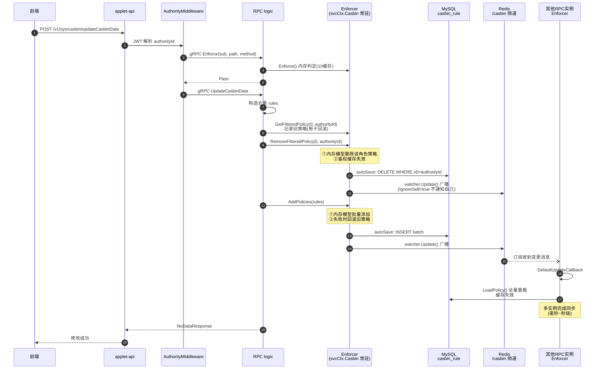
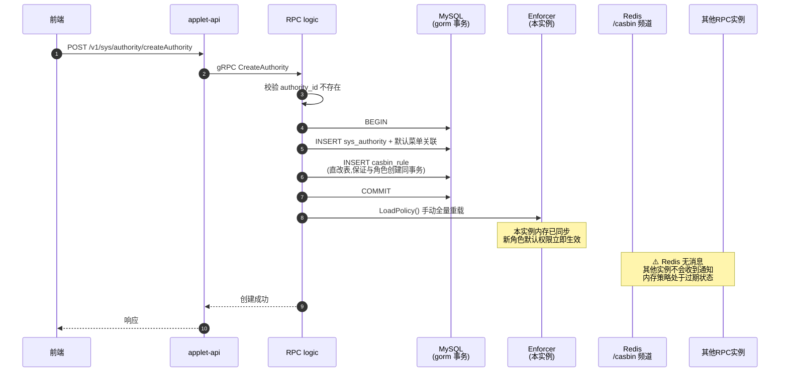
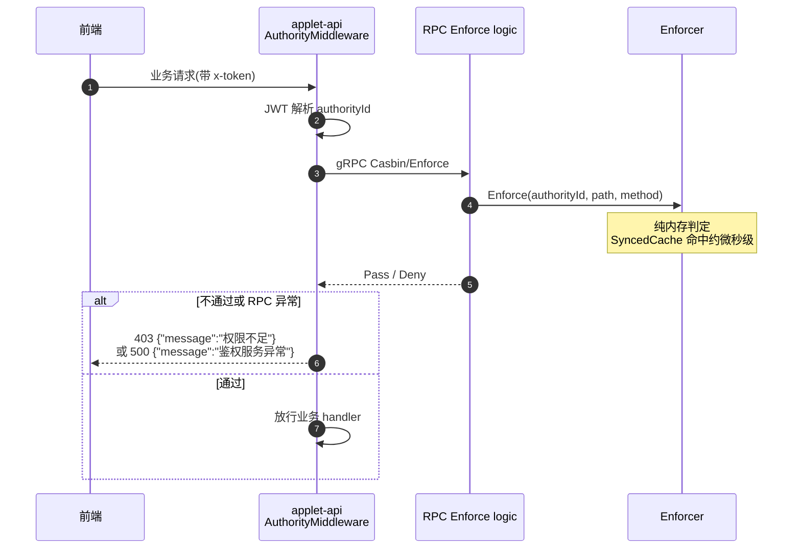

# Casbin 策略写路径时序与同步边界说明

> 适用范围：`go-zero-admin` applet 模块（api + rpc）
> 核心封装：`pkg/middlecasbin/middlecasbin.go`
> 文档日期：2026-08-16

---

## 1. 背景与架构总览

权限鉴权采用 casbin RBAC（`SyncedCachedEnforcer`），策略存储于 MySQL `casbin_rule` 表，多实例间通过 Redis `/casbin` 频道（redis-watcher）同步。

自 2026-08 改造后：**api 层不直连数据库**，所有 casbin 读写收敛到 rpc 服务；api 层中间件通过 `Casbin/Enforce` gRPC 接口鉴权。

### 组件角色

| 组件 | 位置 | 职责 |
|---|---|---|
| applet-api | `application/applet/api` | HTTP 网关，JWT 解析，`AuthorityMiddleware` 调 RPC Enforce |
| applet-rpc | `application/applet/rpc` | 持有唯一常驻 enforcer，全部策略读写 |
| Enforcer | `rpc/internal/svc/service_context.go` | `SyncedCachedEnforcer` 进程内单例（`sync.Once`），1h 鉴权结果缓存 |
| MySQL | `casbin_rule` 表 | 策略持久化（gorm adapter，autoSave 自动落库） |
| Redis | `/casbin` 频道 | watcher 广播，实例间策略变更通知（`IgnoreSelf=true`） |

### 核心机制要点

1. **enforcer 单例**：整个 rpc 进程只在 `NewServiceContext` 创建一次，所有 logic 复用 `svcCtx.Casbin`，禁止在 logic 内重新创建（历史 bug：重复创建会触发 `SavePolicy` 全量写库 + 重复挂 watcher，已根除）。
2. **autoSave**：enforcer 写策略 API（AddPolicies / RemoveFilteredPolicy / UpdatePolicies 等）在更新内存的同时自动写 MySQL，并通过 watcher 广播。
3. **禁止调用 `SavePolicy()`**：全量把内存写回 DB（DELETE ALL + INSERT），存在清空线上策略表的风险，当前代码已移除。
4. **matcher 统一为 `keyMatch2`**：rpc yaml 的 `CasbinConf.ModelText` 与 `middlecasbin.defaultModelText` 保持一致。

---

## 2. 写路径清单总览

| # | 写路径 | RPC logic | 写入方式 | 内存同步 | 多实例广播 |
|---|---|---|---|---|---|
| 1 | 更新角色权限 | `casbin/update_casbin_data_logic.go` | enforcer API | 自动 | 自动 |
| 2 | 按 API IDs 更新角色权限 | `casbin/update_casbin_data_by_api_ids_logic.go` | enforcer API | 自动 | 自动 |
| 3 | 删除单条 API | `api/delete_api_logic.go` | enforcer `RemoveFilteredPolicy` | 自动 | 自动 |
| 4 | 批量删除 API | `api/delete_apis_by_ids_logic.go` | enforcer `RemoveFilteredPolicy` | 自动 | 自动 |
| 5 | 更新 API 路径/方法 | `api/update_api_logic.go` | enforcer `UpdatePolicies` | 自动 | 自动 |
| 6 | 创建角色（含默认策略） | `authority/create_authority_logic.go` | **gorm 事务直改表** | 事务后手动 `LoadPolicy()` | **无广播** |
| 7 | 删除角色（含策略） | `authority/delete_authority_logic.go` | **gorm 事务直改表** | 事务后手动 `LoadPolicy()` | **无广播** |

> 路径 1–5 走 enforcer API，属于"全自动"路径；路径 6–7 为了保证"角色 + 关联菜单 + 策略"事务原子性直改表，属于"半自动"路径（详见第 4 节边界说明）。

---

## 3. 时序图

### 3.1 路径 A：enforcer 写操作（全自动同步 + 广播）

代表接口：`UpdateCasbinData`（其余 enforcer 写路径同理）

### 3.2 路径 B：事务直改表（本实例手动同步，无广播）

代表接口：`CreateAuthority`（`DeleteAuthority` 同理）

### 3.3 读路径（背景参考）：HTTP 鉴权

---

## 4. 内存同步与多实例广播边界

### 4.1 边界矩阵

| 写路径 | 本实例内存 | MySQL 落库 | 多实例广播 | 一致性窗口 |
|---|---|---|---|---|
| UpdateCasbinData / ByApiIds | enforcer API 自动 | autoSave 自动 | watcher 自动 | 毫秒~秒级 |
| delete_api / delete_apis_by_ids | enforcer API 自动 | autoSave 自动 | watcher 自动 | 毫秒~秒级 |
| update_api（UpdatePolicies） | enforcer API 自动 | autoSave 自动 | watcher 自动 | 毫秒~秒级 |
| **create_authority / delete_authority** | **事务后手动 LoadPolicy** | 事务直改表 | **❌ 无广播** | **其他实例过期，直至其自身下一次写操作触发广播或重启** |
| 读路径 Enforce | 1h 结果缓存 | — | 写操作/watcher 自动失效缓存 | — |

### 4.2 当前部署形态结论

- **单实例 rpc（当前形态）**：所有路径内存与 DB 最终一致，无风险。
- **多实例 rpc**：唯一不一致窗口为 create/delete authority。若未来扩展为多实例，需补充广播（方案：事务提交后在 svc 中持有 watcher 实例并手动 `Publish`，或改为 enforcer API 写入 + 补偿事务）。

### 4.3 失败场景行为

| 场景 | 行为 |
|---|---|
| `UpdateCasbinData`：删旧成功、加新失败 | 自动回滚旧策略（`AddPolicies(oldRules)`），回滚失败仅记 Errorf 日志 |
| `LoadPolicy` 失败（DB 抖动） | 记 Errorf，接口仍返回成功；内存保持旧策略，下次写操作或 watcher 通知会重试加载 |
| enforcer 初始化失败（启动时 DB 不可用） | `MustNewCasbin` 直接 panic，rpc 进程启动失败（fail-fast，避免运行期 nil panic） |
| watcher Redis 不可用 | 写操作仍正确落库 + 本实例内存同步；仅跨实例通知延迟，恢复后需手动触发一次 LoadPolicy 或等下次写操作 |
| `CasbinInfoList` 传空列表 | 语义为"清空该角色全部权限"，正常返回成功（历史 bug 已修复） |

---

## 5. 关键代码索引

| 主题 | 文件 |
|---|---|
| enforcer 封装（单例/autoSave/watcher/默认模型） | `pkg/middlecasbin/middlecasbin.go` |
| enforcer 唯一创建点 | `application/applet/rpc/internal/svc/service_context.go` |
| 鉴权中间件（RPC Enforce + 403/500 响应） | `application/applet/api/internal/middleware/authority_middleware.go` |
| Enforce RPC 实现 | `application/applet/rpc/internal/logic/casbin/enforce_logic.go` |
| enforcer 写路径 | `application/applet/rpc/internal/logic/casbin/update_casbin_data_logic.go`、`update_casbin_data_by_api_ids_logic.go` |
| API 增删改同步策略 | `application/applet/rpc/internal/logic/api/update_api_logic.go`、`delete_api_logic.go`、`delete_apis_by_ids_logic.go` |
| 角色增删（事务直改表） | `application/applet/rpc/internal/logic/authority/create_authority_logic.go`、`delete_authority_logic.go` |
| 模型配置 | `application/applet/rpc/etc/applet.yaml` → `CasbinConf.ModelText`（keyMatch2） |

---

## 6. 变更记录

| 日期 | 变更 |
|---|---|
| 2026-08-16 | api 层去 DB 化，casbin 读写收敛至 rpc；新增 `Casbin/Enforce` gRPC 接口；移除 `SavePolicy` 全量写库；matcher 统一 `keyMatch2`；watcher `IgnoreSelf=true`；删除 API 同步清理策略；角色增删后补 `LoadPolicy`；鉴权失败返回 403/500 JSON |
