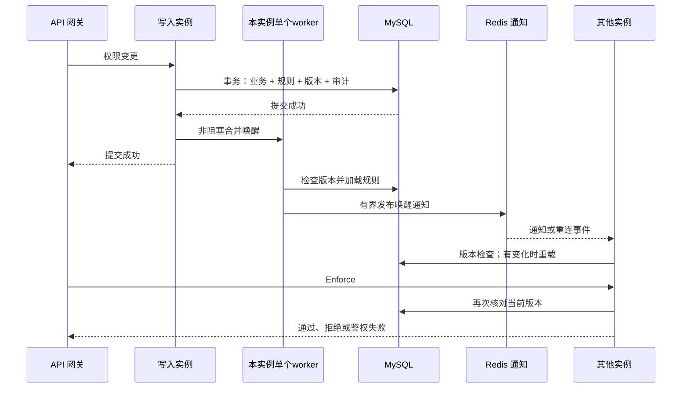

# Casbin 策略写入、审计与多实例同步

更新日期：2026-10-03。适用范围：applet API 和 RPC。

API 不直连数据库，通过 `Casbin/Enforce` RPC 鉴权。每个 `ServiceContext` 持有自己的常驻 `SyncedCachedEnforcer`，关闭鉴权结果缓存，避免旧的允许结果跨越策略重载。RPC 正式启动使用 `CasbinConf.NewPolicySynchronizer`，共用业务数据库连接池；旧的 Redis watcher 工厂不参与当前服务启动。

## 写入顺序

权限变更统一使用 `accessutil.PolicyTransaction(ctx, svc, change)`：

1. 使用请求上下文启动数据库事务，锁定内置管理员保护行。
2. 保存管理员恢复入口的可用状态，执行业务数据与 `casbin_rule` 的变更。
3. 校验不能删除已有的管理员权限恢复入口。
4. 在同一事务内递增 `sys_policy_versions` 中 `id=1` 的版本。
5. 在同一事务写入 `sys_audit_logs`，记录模块 `permission`、动作 `commitPolicy`、可信请求路径、方法和操作者；不保存策略内容。
6. 全部成功才提交。审计或任一业务写入失败，业务数据、策略和版本一起回滚。
7. 提交后只向容量1的唤醒队列发送非阻塞通知，然后返回成功。已有单个后台worker检查版本、重载本实例策略并发送 Redis `/casbin` 通知；重复唤醒合并，不为每次请求创建goroutine。通知只是提前检查的优化。

角色创建、角色删除、角色 API 权限替换、API 创建、路径或方法修改、API 批量删除均走同一封装；单 API 删除委托批量逻辑。Swagger 资源同步仅添加资源或修改说明，不修改规则和授权，因此无需权限版本递增。

生产 enforcer 使用带超时的只读适配器。直接 `AddPolicy`、`RemovePolicy`、`SavePolicy` 会失败，防止绕过业务事务、管理员保护和版本递增；不要对线上规则全量写回。

## 多实例恢复

每个同步器通过三个入口核对数据库版本：

- 默认每两秒定期检查，与 Redis 是否可用无关。
- Redis 订阅接到通知或重连订阅事件后立即检查；发布丢失不影响持久化版本。
- 每个 `Enforce` RPC 请求先检查版本；版本落后时成功重载后才鉴权。数据库无法核对版本时拒绝鉴权，不继续使用可能过期的权限。

重载前后分别读取版本。如果重载期间有其他实例提交更改，保存的旧版本不会被当成最新版本，最多重试三次；连续变动或数据库错误返回鉴权失败，下次检查继续恢复。所有数据库检查、策略加载和Redis发布有三秒超时；鉴权检查还遵守更短的请求期限。慢Redis发布不会占用权限写入请求或全局写入锁。`ServiceContext.Close()` 取消工作线程与正在进行的发布、关闭 Redis 订阅与连接，再关闭数据库连接池。

```mermaid
sequenceDiagram
    participant API as API 网关
    participant RPC1 as 写入实例
    participant Worker as 本实例单个worker
    participant DB as MySQL
    participant Redis as Redis 通知
    participant RPC2 as 其他实例
    API->>RPC1: 权限变更
    RPC1->>DB: 事务：业务 + 规则 + 版本 + 审计
    DB-->>RPC1: 提交成功
    RPC1->>Worker: 非阻塞合并唤醒
    RPC1-->>API: 提交成功
    Worker->>DB: 检查版本并加载规则
    Worker->>Redis: 有界发布唤醒通知
    Redis-->>RPC2: 通知或重连事件
    RPC2->>DB: 版本检查；有变化时重载
    API->>RPC2: Enforce
    RPC2->>DB: 再次核对当前版本
    RPC2-->>API: 通过、拒绝或鉴权失败
```

## 失败与恢复边界

| 场景 | 行为 |
|---|---|
| 业务、规则、版本、事务审计写入失败 | 同一事务回滚，返回失败 |
| 提交后本实例重载失败或变慢 | 请求不等待重载，修改已提交并返回成功；后台与鉴权检查重试；当前鉴权无法检查最新规则时失败 |
| Redis 通知发布失败、变慢或断线期间漏通知 | 请求不等待发布；数据库版本保留变更，定期检查、重连事件和鉴权检查恢复；通知队列至多保留一个待处理唤醒 |
| 初次启动缺少版本迁移、数据库不可用或规则不匹配模型 | RPC 停止启动，避免携带无效鉴权状态运行 |
| 请求取消或超时 | 未提交事务随请求上下文取消；已提交后不在请求中做网络工作，后台同步使用独立、有界且可关闭的上下文 |
| 人工修改 `casbin_rule` | 必须同事务递增 `sys_policy_versions.version` 并保留审计；否则版本检查无法识别外部修改 |

菜单与按钮授权使用 `AdminMenuTransaction`：同事务校验管理员菜单恢复能力并写入 `commitMenu` 审计。用户注册、资料或角色变更、冻结、删除、改密、重置密码分别写事务审计。HTTP 请求审计用于记录失败和请求耗时；事务审计用于证明具体敏感变更成功提交。

## 部署与验证

先执行 `data/db/migrations/20261002_00_policy_sync.sql` 及审计迁移，再启动新版服务。本机 RPC 默认仅监听 `127.0.0.1:6001`；部署模板使用 go-zero 内置 `Auth=true`、`StrictControl=true`，API 与 RPC 配置相同应用标识及密钥。RPC 密钥登记和轮换见 `docker/部署说明.md`。

回归覆盖丢失通知后的跨实例撤权、策略加载失败重试、重载期间并发提交、版本事务回滚、请求取消、线程退出、缺失迁移、事务审计失败回滚。新增回归先复现慢重载/Redis阻塞提交响应，再验证非阻塞返回、写入锁及时释放、1000次通知合并、关闭取消慢发布，以及重载被阻塞时Enforce仍拒绝旧缓存、恢复后撤权生效。代码入口：`pkg/middlecasbin/policy_sync.go`、`accessutil/policy.go`、`casbin/enforce_logic.go`、`pkg/audit/event.go`。
